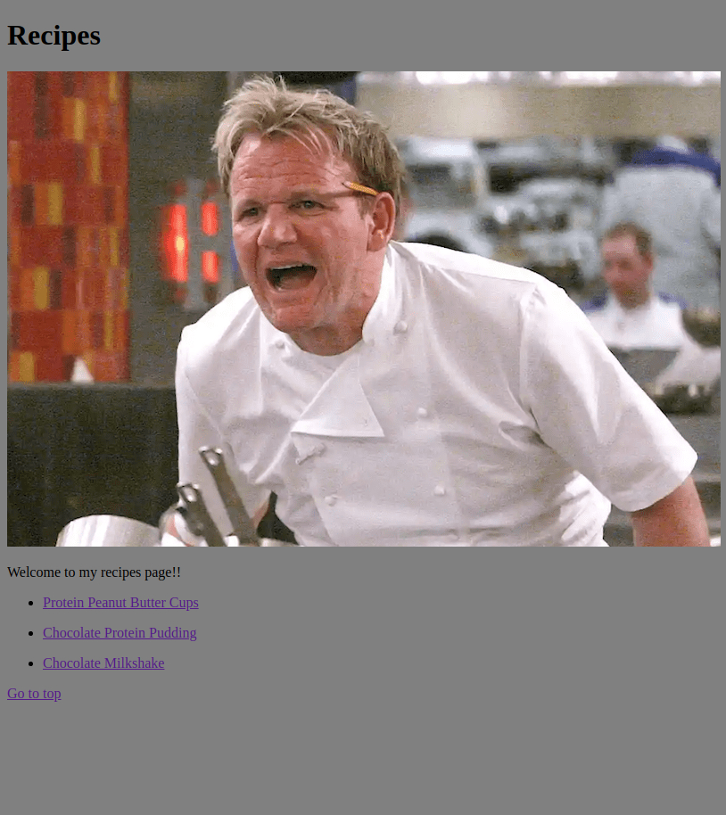

# Recipes
>Simple HTML with recipes subpages.

## Table of Contents
* [General Info](#general-information)
* [Technologies Used](#technologies-used)
* [Features](#features)
* [Screenshots](#screenshots)
* [Setup](#setup)
* [Project Status](#project-status)
* [Acknowledgements](#acknowledgements)
* [Contact](#contact)

## General Information
- Part of The Odin Project course. 
- This project aims to test HMTL skills by creating basic website and basics of committing code to GitHub. 
- The website consists of the main index page which will have links to a few recipes.

## Technologies Used
- HTML 5

## Features
List the ready features here:
- "Go to top" and "Main page"
- Added dark background color for better visibility

## Screenshots

## Setup
Simple index.html with subpages containing recipes - no need to install or setup.

## Project Status
Project is:<s>_in progress_</s>/_complete_/<s> _no longer being worked on_</s>

## Acknowledgements
Give credit here.
- This project was inspired by [@TheOdinProject](https://github.com/TheOdinProject)
- Many thanks to [@ritaly](https://github.com/ritaly) For Providing README.md cheatsheet

## Contact
Created by [@ZaKu1337](https://github.com/ZaKu1337) - feel free to contact me!